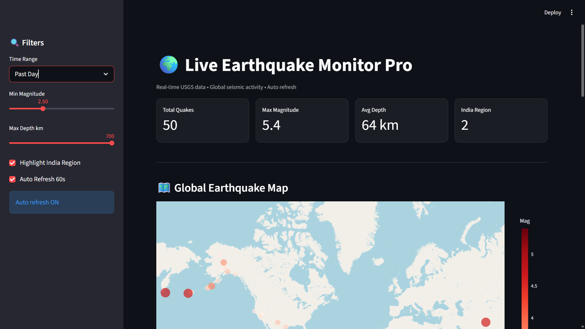
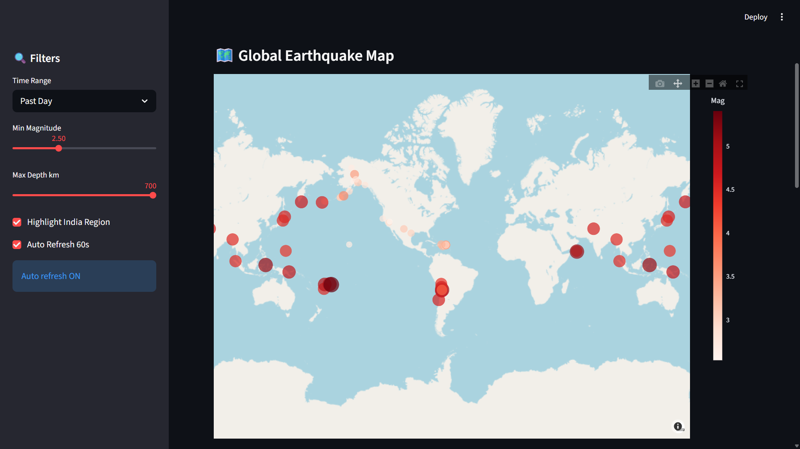
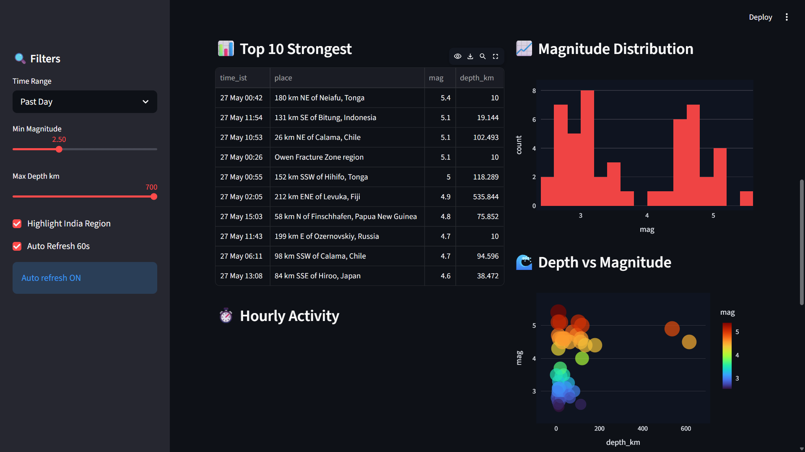
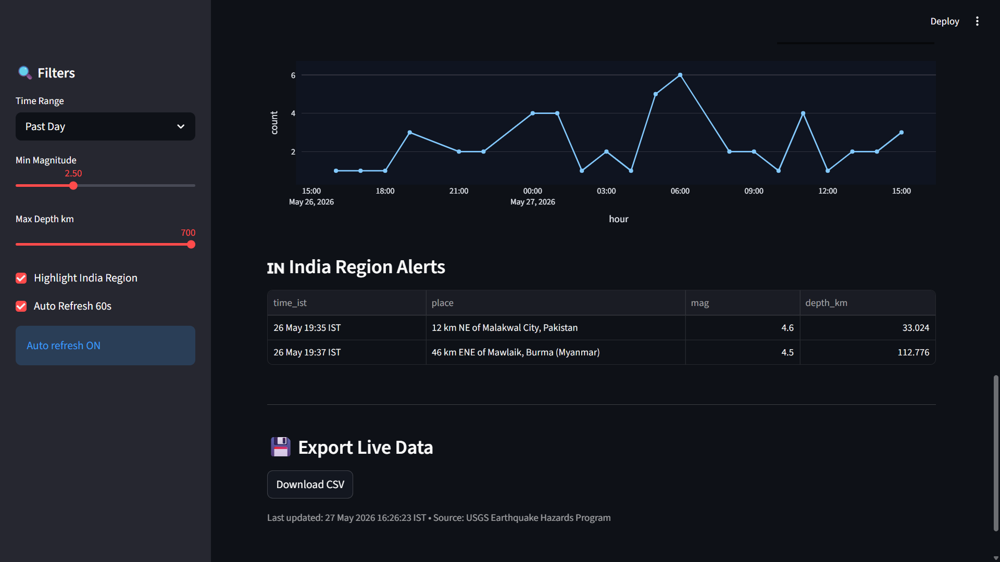

# 🌍 Live Earthquake Monitor Pro

Real-time global seismic activity dashboard powered by USGS data. Track earthquakes worldwide with interactive maps, live KPIs, and India-specific alerts.

**Live Demo:** *https://live-earthquake-monitor-pro-nqtjib8ryqjaylujaxk8xj.streamlit.app/*

---

## ✨ Features

- **Live USGS Feed** - Past Hour / Day / 7 Days / 30 Days
- **Interactive Global Map** - Magnitude sized bubbles with color scale
- **Smart Filters** - Min Magnitude, Max Depth, Time Range
- **India Region Highlight** - Auto-detects quakes near India
- **Analytics Suite:** Top 10, Magnitude Distribution, Depth vs Magnitude, Hourly Activity
- **Auto Refresh 60s** - Always up-to-date
- **CSV Export** - Download live data

---

## 📸 Screenshots

### 1. Dashboard & Live KPIs


### 2. Global Earthquake Map


### 3. Analytics - Top 10 & Charts


### 4. Hourly Activity & India Alerts


---

## 🛠️ Tech Stack

- Streamlit, Pandas, Plotly, Requests, Pytz
- Data Source: USGS Earthquake Hazards Program

---

## 🚀 Run Locally

```bash
git clone https://github.com/akash1234-design/live-earthquake-monitor-pro.git
cd live-earthquake-monitor-pro
pip install -r requirements.txt
streamlit run app_earthquake.py
